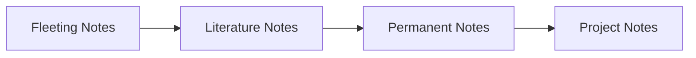

<div align="center">

# 💬 ChatNote
## https://chatbot.kakao.com/bot/6957875684dcee6380090caa/action/69578798f37f4f7df329aa92 


### AI-Powered Smart Memo for KakaoTalk


**카카오톡으로 메모하면, AI가 자동 분류하고 예쁘게 정리해주는 스마트 메모 서비스**

[🚀 시작하기](#-quick-start) • [📖 문서](#-목차) • [🎯 PlayMCP](#) • [💡 기여하기](#)

---

</div>

## 📑 목차

- [1. 메모 관리 방법론](#1--메모-관리-방법론)
- [2. 콘텐츠 기반 메모 유형](#2--콘텐츠-기반-메모-유형)
- [3. 목적 기반 메모 유형](#3--목적-기반-메모-유형)
- [4. 플랫폼별 메모 패턴](#4--플랫폼별-메모-패턴)
- [5. 패턴 감지 (정규식)](#5--패턴-감지-정규식)
- [6. 시간 기반 조회](#6--시간-기반-조회)
- [7. 리치 미디어 응답](#7--리치-미디어-응답)
- [8. URL 임베딩 가이드](#8--url-임베딩-가이드)
- [9. 로드맵](#9--로드맵)

---

## 1. 📚 메모 관리 방법론

<details>
<summary><b>🧠 PARA Method (Tiago Forte)</b></summary>

> "Building a Second Brain" - 디지털 정보 관리의 표준

| 분류 | 설명 | 예시 |
|:---:|------|------|
| **P**rojects | 단기 목표가 있는 작업 | 웹사이트 리뉴얼, 이사 준비 |
| **A**reas | 장기 관리 영역 | 건강, 재정, 커리어 |
| **R**esources | 관심 주제/참고 자료 | 요리 레시피, 투자 정보 |
| **A**rchives | 비활성 항목 | 완료 프로젝트, 과거 자료 |

</details>

<details>
<summary><b>🗂️ Zettelkasten Method</b></summary>

> 니클라스 루만의 지식 관리 시스템



| 노트 유형 | 설명 | 특징 |
|:--------:|------|------|
| Fleeting | 순간적인 아이디어 | 임시, 빠른 캡처 |
| Literature | 읽은 내용 요약 | 출처 포함, 인용 |
| Permanent | 정제된 핵심 지식 | 원자적, 연결됨 |

</details>

<details>
<summary><b>✅ GTD (Getting Things Done)</b></summary>

```
📥 Capture → 🔍 Clarify → 📂 Organize → 🔄 Reflect → ⚡ Engage
```

- **Inbox**: 모든 입력의 첫 관문
- **Quick Capture**: 즉시 기록, 나중에 정리
- **Next Action**: 다음에 할 구체적 행동

</details>

---

## 2. 📦 콘텐츠 기반 메모 유형

### 🔗 URL/링크 기반

| 유형 | 예시 플랫폼 | 추출 메타데이터 |
|:----:|------------|----------------|
| 🎬 **영상** | YouTube, Vimeo | 제목, 채널, 썸네일 |
| 📰 **아티클** | 블로그, 뉴스 | 제목, 저자, 요약 |
| 🛒 **쇼핑** | 쿠팡, 네이버 | 상품명, 가격, 이미지 |
| 📍 **장소** | 카카오맵, 네이버지도 | 장소명, 주소, 카테고리 |
| 🍳 **레시피** | 만개의레시피 | 요리명, 재료, 시간 |
| 🎵 **음악** | Spotify, 멜론 | 곡명, 아티스트, 앨범 |

### 📝 텍스트 기반

| 유형 | 패턴 인식 | 예시 |
|:----:|----------|------|
| 💡 아이디어 | "~하면 어떨까" | 앱 아이디어 메모 |
| 📖 인용구 | 따옴표, "~라고 했다" | 책 명언 저장 |
| 📅 일정 | 날짜+시간+장소 | "12/25 15:00 강남역" |
| 📞 연락처 | 010-XXXX-XXXX | 전화번호 저장 |
| 💳 계좌 | 은행+계좌번호 | 국민은행 123-456-789 |

---

## 3. 🎯 목적 기반 메모 유형

### ✔️ 할일/태스크

```
☐ 단순 할일     → "우유 사기"
☐ 기한 할일     → "금요일까지 보고서"
☐ 반복 할일     → "매주 월요일 회의"
☐ 위임 할일     → "@김대리 자료 요청"
```

### 📋 리스트 종류

| 이모지 | 리스트 유형 | 예시 |
|:-----:|-----------|------|
| 🛒 | 장보기 목록 | 우유, 계란, 빵 |
| 🎁 | 위시리스트 | 에어팟, PS5 |
| ✈️ | 패킹리스트 | 여권, 충전기 |
| 📚 | 읽을책 목록 | 원씽, 아토믹해빗 |
| 🎬 | 볼영화 목록 | 인터스텔라 |

---

## 4. 📱 플랫폼별 메모 패턴

### 💬 카카오톡 나에게 보내기 (가장 많이 사용)

```
📊 사용 패턴 분석

   URL 공유 ████████████████████ 70%
   텍스트    ██████████░░░░░░░░░░ 25%
   이미지    ██░░░░░░░░░░░░░░░░░░  5%
```

**주요 URL 타입:**
- 유튜브 영상 (40%)
- 쇼핑 링크 (30%)
- 기사/블로그 (20%)
- 기타 (10%)

---

## 5. 🔍 패턴 감지 (정규식)

<details>
<summary><b>📺 YouTube 패턴</b></summary>

```python
YOUTUBE_PATTERNS = [
    r'youtube\.com/watch\?v=([a-zA-Z0-9_-]{11})',
    r'youtu\.be/([a-zA-Z0-9_-]{11})',
    r'youtube\.com/shorts/([a-zA-Z0-9_-]{11})'
]
```

</details>

<details>
<summary><b>📍 지도 패턴</b></summary>

```python
MAP_PATTERNS = {
    'kakao': r'map\.kakao\.com/[^\s]+',
    'naver': r'map\.naver\.com/[^\s]+'
}
```

</details>

<details>
<summary><b>📞 연락처/금융 패턴</b></summary>

```python
# 전화번호
PHONE_PATTERN = r'01[0-9]-?\d{3,4}-?\d{4}'

# 이메일
EMAIL_PATTERN = r'[\w.-]+@[\w.-]+\.\w+'

# 계좌번호
BANK_PATTERN = r'(국민|신한|우리|하나|농협|카카오|토스).{0,5}\d{2,6}-?\d{2,6}-?\d{2,6}'
```

</details>

---

## 6. ⏰ 시간 기반 조회

### 🗣️ 자연어 시간 쿼리

| 쿼리 | 파싱 결과 | SQL 변환 |
|-----|----------|---------|
| "어제 메모" | `yesterday` | `created_at >= NOW() - 1 day` |
| "이번주 영상" | `this_week` | `created_at >= week_start` |
| "지난달 맛집" | `last_month` | `created_at BETWEEN ...` |
| "최근 3일" | `last_3_days` | `created_at >= NOW() - 3 days` |

### 💾 Redis 시간 인덱싱

```
user:{id}:memos          → ZSET (score=timestamp)
user:{id}:memos:2025-01  → 월별 인덱스 (선택)
```

---

## 7. 🎨 리치 미디어 응답

> ⚠️ **중요**: `simpleText`는 URL 미리보기를 **자동 생성하지 않음!**

### 📊 응답 타입 비교

| 타입 | 용도 | 시각적 요소 |
|:---:|------|-----------|
| `simpleText` | 단순 알림 | 텍스트만 |
| `basicCard` | **유튜브, 기사** | 썸네일+제목+버튼 |
| `listCard` | **검색 결과** | 여러 항목 목록 |
| `carousel` | 여러 상품 | 슬라이드 카드 |

### 🎬 YouTube BasicCard 예시

```json
{
  "basicCard": {
    "title": "FastAPI 강좌",
    "description": "📺 파이썬 코딩배우기",
    "thumbnail": {
      "imageUrl": "https://img.youtube.com/vi/{VIDEO_ID}/hqdefault.jpg"
    },
    "buttons": [
      { "action": "webLink", "label": "▶️ 보기", "webLinkUrl": "..." }
    ]
  }
}
```

### 📋 검색 결과 ListCard

```json
{
  "listCard": {
    "header": { "title": "🔍 '맛집' 검색 (3건)" },
    "items": [
      { "title": "봇나무집", "description": "🍖 맛집 • 어제" },
      { "title": "멘야하나비", "description": "🍜 맛집 • 3일전" }
    ]
  }
}
```

---

## 8. 🔗 URL 임베딩 가이드

### 📺 YouTube 썸네일 추출

> API 키 없이 썸네일 URL 직접 생성

```python
def get_youtube_thumbnail(video_id: str, quality: str = "hq") -> str:
    """
    quality: 'max' (1280x720), 'hq' (480x360), 'mq' (320x180)
    """
    return f"https://img.youtube.com/vi/{video_id}/{quality}default.jpg"
```

### 🌐 oEmbed API (API 키 불필요)

```python
async def get_video_metadata(video_url: str) -> dict:
    oembed = f"https://www.youtube.com/oembed?url={video_url}&format=json"
    async with httpx.AsyncClient() as client:
        response = await client.get(oembed)
        return response.json()  # title, author_name, thumbnail_url
```

### 🏷️ OpenGraph 메타데이터

```python
async def extract_og_data(url: str) -> dict:
    """og:title, og:image, og:description 추출"""
    response = await httpx.get(url)
    soup = BeautifulSoup(response.text, 'html.parser')

    return {
        tag['property'].replace('og:', ''): tag['content']
        for tag in soup.find_all('meta', property=lambda x: x and 'og:' in x)
    }
```

### 📐 UI/UX 가이드라인

| 필드 | 권장 | 최대 |
|:---:|:---:|:---:|
| title | 20자 | 40자 |
| description | 40자 | 60자 |
| button label | 8자 | 14자 |

---

## 9. 🛤️ 로드맵

### Phase 1: 기본 기능 ✅

- [x] 메모 저장/조회/삭제
- [x] AI 카테고리 분류
- [x] MCP 서버 연동
- [x] 7개 MCP 도구 구현

### Phase 2: 시간 기반 조회 🚧

- [ ] 자연어 시간 파싱 ("어제", "이번주")
- [ ] 기간 + 카테고리 복합 검색
- [ ] 시간 메타데이터 인덱싱

### Phase 3: 리치 응답 📋

- [ ] YouTube → BasicCard (썸네일)
- [ ] 검색결과 → ListCard
- [ ] QuickReplies 추가

### Phase 4: 스마트 기능 🔮

- [ ] 카카오맵 장소 연동
- [ ] 일정 자동 파싱
- [ ] 금융정보 마스킹

---

<div align="center">

## 💬 ChatNote

**카카오톡 메모의 새로운 경험**

Made with ❤️ for PlayMCP 2025


</div>
